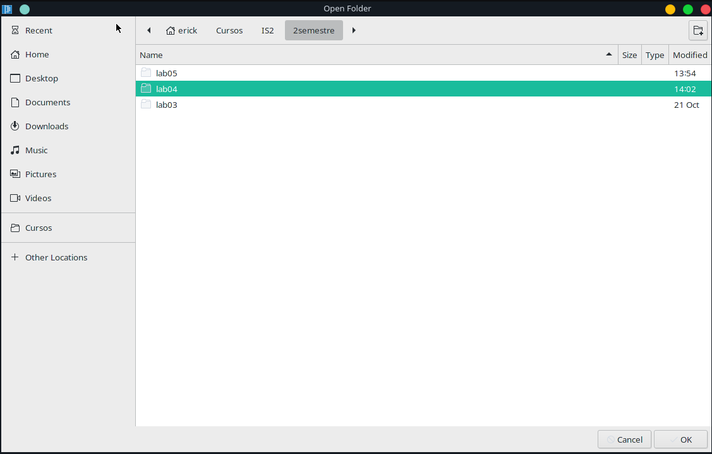
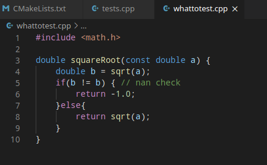
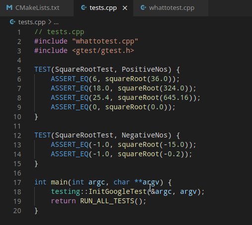
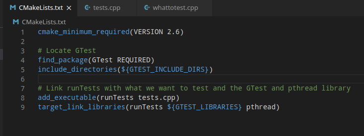
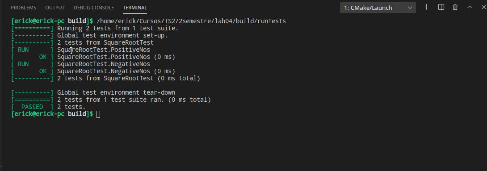
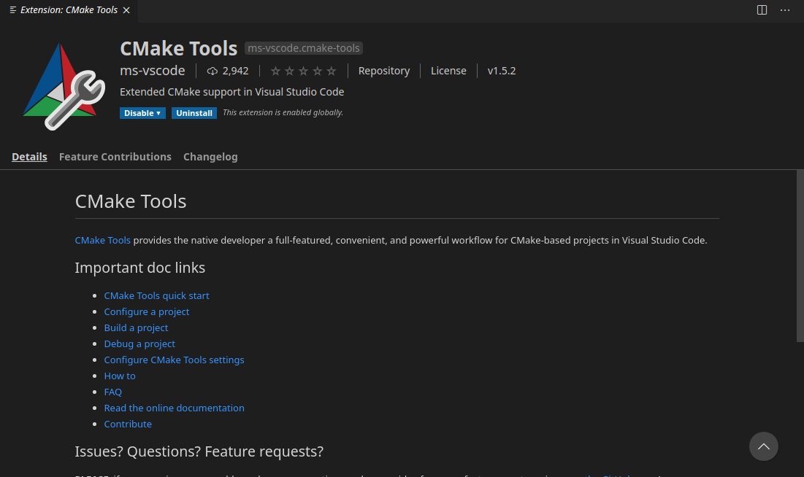
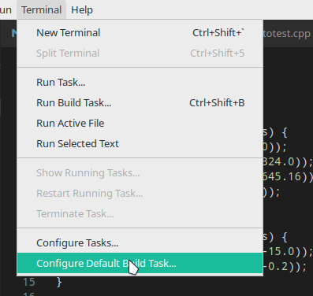
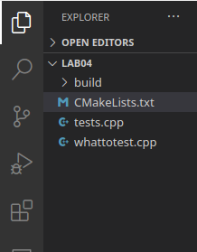
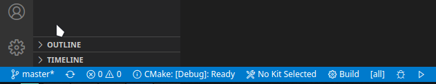

# INTEGRACIÓN GTEST VISUAL STUDIO

## Instalación
En caso de no ternerlo instalado tratar de instalarlo con el siguiente codigo que es para ubuntu, en casos de otros linux buscar la equivalencia, si se trata de windows, por lo general vendra integrado en algun IDE
```
    sudo apt-get install libgtest-dev
```

## Creación del proyecto
Simplemente crear una carpeta y empezar a trabajar


## Pruebas 
Crearemos programas que nos permitan ver como funciona gtest

Crear funcion normal y simple



Crear las pruebas



Crear el documento CMake



Ejecutamos lo siguiente y vemos el resultado
```
cmake CMakeLists.txt
make
./runTests
```



## Integracion de gtest
Intalamos la herramienta CMake tools



Vamos a terminal, y creamos una nueva built 



Se creara la carpeta built



Corre con el boton de play 



Nos mostrara el resultado

