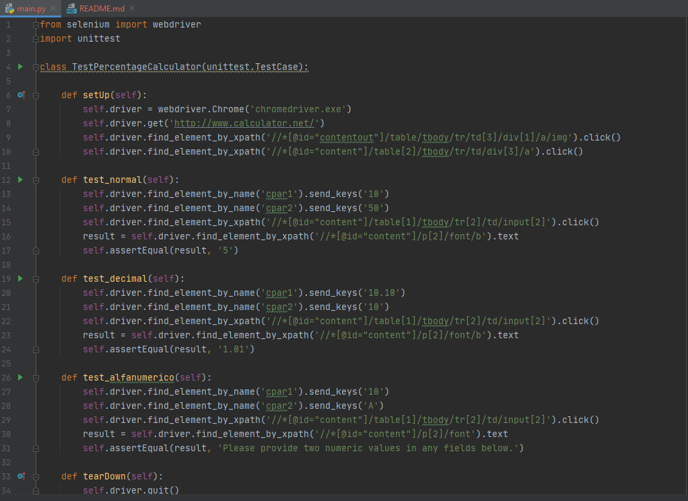
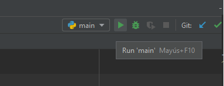
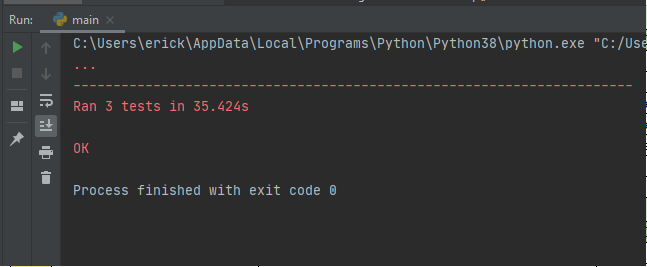
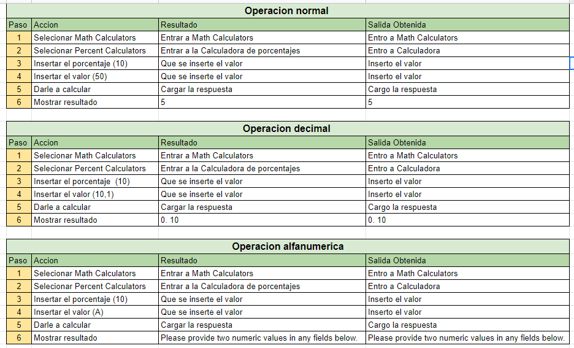

# Pruebas Funcionales y xUnit

## Requisitos
Tener instalado:
```
    Python 3.8
    Selenium
    Chromedriver
    Unit test
```

## Creación del proyecto
Iniciar el proyecto con tu IDE  de preferencia en este caso Pycharm y crear el script para correr las pruebas


## Ejecucion 
Asegurarse de importar el selenium y el unit test, Luego simplemente correr el script



## Resultados
En consola nos mostrara si las pruebas se realizaron con exito


## Casos de prueba

